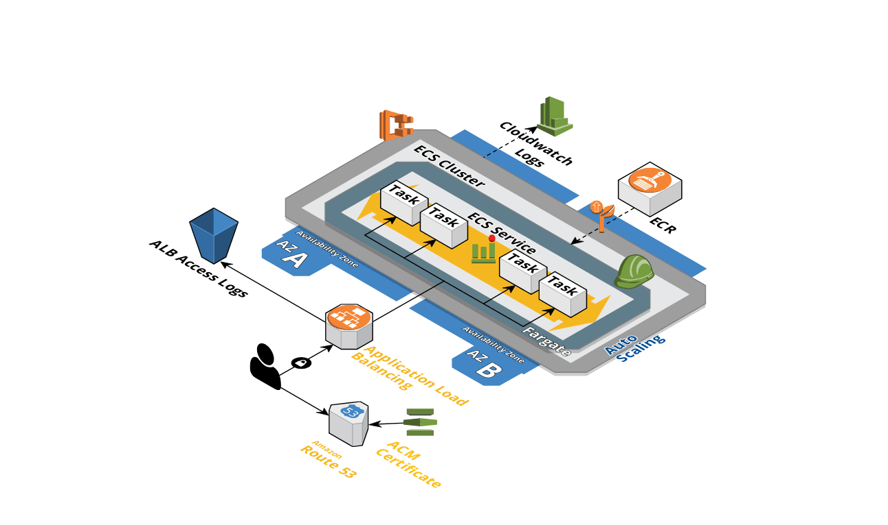

# Terraform ECS with Fargate
A set of **Terraform** templates used as an example of deployment ***AWS*** infrastructure with ***ECS Fargate***.



## About ECS Fargate

Amazon ECS features AWS Fargate, so you can deploy and manage containers without having to provision or manage servers.
With Fargate, you no longer have to select Amazon EC2 instance types, provision, and scale clusters of virtual machines to run containers or schedule containers to run on clusters and maintain their availability.
Fargate enables you to focus on building and running applications, not the underlying infrastructure.

## About this project
This repository contains Terraform configuration for **ECS** with **Fargate** (`Fargate` directory).

Templates deploy via Terraform a default nginx docker image and set up required AWS services. For example: IAM, Load Balancer, S3, VPC, CloudWatch (including Auto Scaling and Logs) and Route53 with ACM (add DNS records, create and validate certificate). 

## Prerequisites

- Install `terraform`, to get started, visit [terraform.io](https://www.terraform.io/intro/getting-started/install.html).
- (Optional) Install `aws-cli`, to get started, visit [docs.aws.amazon.com](https://docs.aws.amazon.com/en_us/cli/latest/userguide/installing.html).
## Getting started

- Create an AWS IAM user with administrative access to: `ECS`, `ECR`, `RDS`, `EC2`, `ACM`, `Route53` and `S3`.
- Download directory with template file.
- Edit the template "sample_variables.template" files and fill it with variables relevant to the environment you're preparing:


```bash
    # for the Fargate:
    cp FARGATE/sample_variables.template FARGATE/variables.tf
```

- Edit `variables.tf` file.

## Usage
Typically, the base Terraform will only need to be run once, and then should only need changes but hardly ever.

Change the directory to the relevant environment you want to initialize ( `cd FARGATE` ).

### Environment initialization
Run the *init* command.
```bash
    # The first command only for initializing (only if didn't start before)
    terraform init

```
### Start/change an environment
Run the *plan* or *apply* command.
```bash
    # to show changes list
    terraform plan

    # to apply the changes
    terraform apply
```

### Stopping(destroying) an environment
Run the *destroy* command.

**Warning!!!** the command will not just stop but completely remove the infrastructure used for this environment :

```bash
    # Run the destroy command
    terraform destroy
```

## Components

These components are for a specific environment. There should be a corresponding directory for each environment that is needed.

| Name | Description | Optional |
|------|-------------|:---:|
| [alb.tf](alb.tf) | ALB, Target Group, Listener, SecurityGroup, output | - |
| [app.tf](app.tf) | ECS task definition, ECR, Route53, ACM  | - |
| [autoscaling.tf](autoscaling.tf) | Performance-based auto scaling | Yes |
| [bucket.tf](bucket.tf) | S3 bucket for access logs ALB, Policy  | - |
| [cluster.tf](cluster.tf) | ECS cluster, ECS service,   | - |
| [iam.tf](iam.tf) | IAM role and policy | - |
| [main.tf](main.tf) | AWS provider | - |
| [sample_variables.template](sample_variables.template) | Template variable file  | - |
| [vpc.tf](vpc.tf) | VPC, Subnet, Internet Gateway, Route Table, Security Group  | - ||

## Variables

| Name | Description | Default | Required |
|------|-------------|:-------:|:--------:|
| alb_internal | Whether the application is available on the public internet, also will determine which subnets will be used (public or private) | false | no |
| alb_port | The port the load balancer will listen on | 80 | no |
| app | The application's name | - | yes |
| app_container_name | The name of the container to run | app | yes |
| app_container_port | The port the container will listen on, used for load balancer health check Best practice is that this value is higher than 1024 so the container processes isn't running at root. | 80 | yes |
| aws_access_key | Like a user name and password, you must use both the access key ID and secret access key together to authenticate your requests. | - | yes |
| aws_cloudwatch_log_group | Default awslogs group name. You can use the name of the project or application | app | yes |
| aws_credentials_profile | (Optional) The AWS Profile to use. You must use the available profile name | default | yes |
| aws_region | The AWS region to use for the dev environment's infrastructure Currently, Fargate is only available in us-east-1. | us-east-1 | no |
| aws_secret_key | Like a user name and password, you must use both the access key ID and secret access key together to authenticate your requests. | - | yes |
| dereg_delay | The amount time for Elastic Load Balancing to wait before changing the state of a deregistering target from draining to unused | 30 | no |
| domain_name | That's root domain zone in route53 | - | yes |
| ecs_as_cpu_high_threshold_per| If the average CPU utilization over a minute rises to this threshold, the number of containers will be increased (but not above ecs_autoscale_max_instances). | 80 | no |
| ecs_as_cpu_low_threshold_per | If the average CPU utilization over a minute drops to this threshold, the number of containers will be reduced (but not below ecs_autoscale_min_instances). | 20 | no |
| ecs_autoscale_max | The maximum number of containers that should be running. Must be no more than ecs_service_count | 5 | no |
| ecs_autoscale_min | The minimum number of containers that should be running. Must be at least 1 | 1 | no |
| ecs_cluster_name | The cluster's name | cluster | no |
| ecs_service_count | The number of instances of the task definition to place and keep running. | 5 | no |
| env | The environment that is being built | qa | no |
| fargate_cpu | The number of CPU units used by the task. You must use one of the supported values. For example: 512 (.5 vCPU) | 512 | no |
| fargate_memory | The number of memory units used by the task. You must use one of the supported values. For example: 1024 (1GB) | 1024 | no |
| health_check_interval | How often to check the liveliness of the container | 30 | no |
| health_check_matcher | What HTTP response code to listen for | 200 | no |
| health_check_timeout | How long to wait for the response on the health check path | 10 | 20 |
| project_name | The project's name | app | no |
| shared_credentials_file | (Optional) You must use the available away for directory with credentials file AWS CLI. Use only if you AWS CLI installed not in the home directory of the user running the Terraform | /root/.aws/credential | yes |
| sub_domain_name | Default sub-domain | nginx.qa. | no |
| vpc | The VPC to use for the Fargate cluster | vpc | yes |
| zone_id | Zone ID for your domain | - | yes ||
