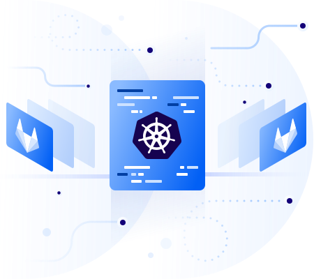

### Terraform DigitalOcean Kubernetes Quick Start template
<!--  -->


## About this project
This repository contains Terraform configuration for **DigitalOcean Kubernetes service**
This project aims to rapidly deploy the kubernetes service on DigitalOcean cloud with all necessary staff like ingress, cert-manager, CI integration, Network/RBAC policies etc...

#### Currently implemented:
- Staging, Production ingresses
- Cert-manager
- GitLab runner
- kube-state-metrics
- metrics-server
- prometheus-operator
- loki-stack

## Prerequisites

- Install `terraform`, to get started, visit [terraform.io](https://www.terraform.io/intro/getting-started/install.html).
- Install `doctl` [github.com](https://github.com/digitalocean/doctl#macos)
- Install `kubectl` [kubernetes.io](https://kubernetes.io/docs/tasks/tools/install-kubectl/)
- (Optional) Install `helm` [helm.sh](https://github.com/helm/helm#install)

## Getting started

- Create an DigitalOcean API token and place it in `terraform.tfvars` file
- Set other values in `terraform.tfvars` (DO slugs, grafana's admin password, webhook for slack notifications, slack channel, see comments in file)
- Change admin email for LetsEncrypt certificates in `./kube/kube-clusterIssuers.yaml` . Default `admin@example.com` (which will de declined!)
- In production run you may need to change PVCs to Retain StorageClass: ( change _do-block-storage_ type to _do-block-storage-retain_ ) and change storage size
- (Optional) Upload ssh rsa key to DigitalOcean, if you using standalone instance in terraform 

### Environment initialization
Run the *init* command.
```bash
    # The first command only for initializing (only if didn't start before)
    terraform init

```
### Start/change an environment by Terraform

#### Warning! 
- because of bug: https://github.com/terraform-providers/terraform-provider-kubernetes/issues/176 
Clear your current kubectl default context to avoid problems

Run the *plan* or *apply* command.
```bash
    # to show changes list
    terraform plan

    # to show and apply the changes
    terraform apply
```
If you have errors in output, you have to get kubeconfig ( https://github.com/terraform-providers/terraform-provider-kubernetes/issues/176 )
```bash
    doctl auth init
    doctl kubernetes cluster kubeconfig save do-fra1-0
```

### Change an environment Manually
- (Optional) If you have multiple environments you can add aliases in ~/.bashprofile:

```bash
alias kubectl-cluster-do='export KUBECONFIG=~/.kube/config-cluster-do; export HELM_HOME=~/.helm-cluster-do; export DIGITALOCEAN_CONTEXT=cluster'
```

```bash
    # Authenticate to DO API and provide generated DigitalOcean user token
    doctl auth init
    # Generate kubeconfig
    doctl kubernetes cluster kubeconfig save do-fra1-0
```

## Getting other stuff running:
- Configure DNS based on LB 
- apply ingresses: grafana....

### Stopping(destroying) an environment
Run the *destroy* command.

**Warning!!!** the command will not just stop but completely remove the infrastructure used for this environment :

```bash
    # Run the destroy command
    terraform destroy
```

### Issues / TODOs:
 - kuberenetes provisioner using local kubeconfig :-\ https://github.com/terraform-providers/terraform-provider-kubernetes/issues/176
 - to remove prometheus operator completely you have to delete CRDs and PVCs: 
 ```bash
 helm delete --purge prometheus-operator
 kubectl delete --ignore-not-found customresourcedefinitions   prometheuses.monitoring.coreos.com   servicemonitors.monitoring.coreos.com   podmonitors.monitoring.coreos.com   alertmanagers.monitoring.coreos.com   prometheusrules.monitoring.coreos.com
 kubectl -n monitoring delete --ignore-not-found pvc alertmanager-prometheus-operator-alertmanager-db-alertmanager-prometheus-operator-alertmanager-0 prometheus-operator-grafana prometheus-prometheus-operator-prometheus-db-prometheus-prometheus-operator-prometheus-0
 ```
 - In some cases `./kube/kube-clusterIssuers.yaml` must be applied manually, cause of Error from server (InternalError): error when creating "": Internal error occurred: failed calling webhook "webhook.certmanager.k8s.io": the server is currently unable to handle the request
 - TODO Default domain, email address in .tfvars
 - TODO nodeSelector